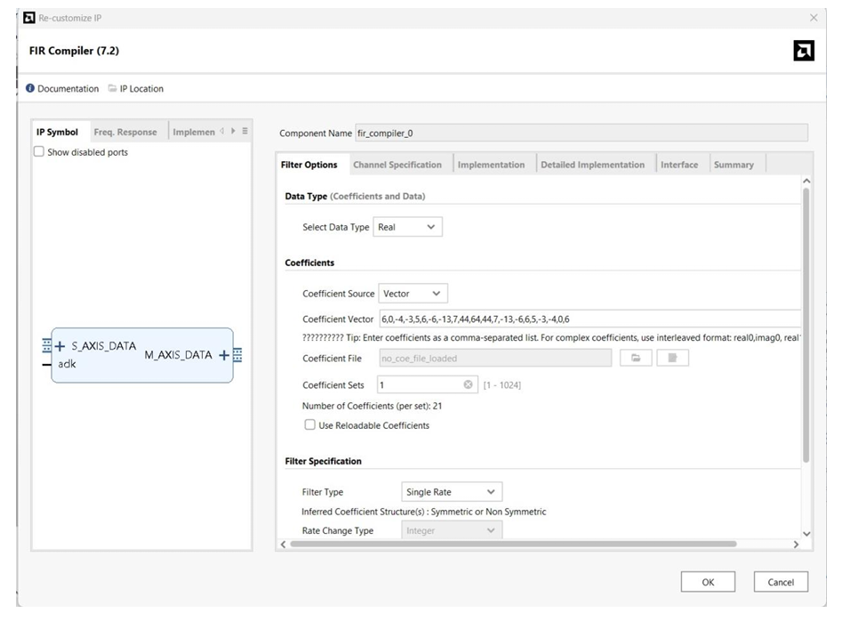
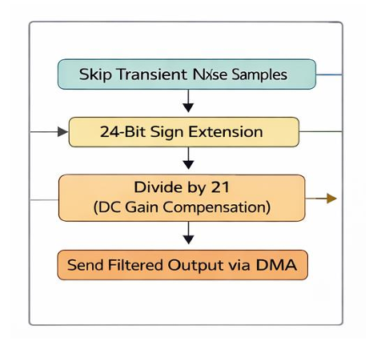

# ⚡ Real-Time Hardware-Accelerated EV BMS Telemetry

**Target Hardware:** Xilinx Zynq-7000 System-on-Chip (SoC)  
**Development Tools:** AMD Xilinx Vivado & Vitis Unified IDE  
**Team Members:** [YOGARATHINAM K], [PRADEEPKUMAR S], [HEMAVARSHINI M], [PRATHANYAA S]

## 🚗 Project Overview
In modern Electric Vehicles, traction inverters switch at incredibly high frequencies, creating massive Electromagnetic Interference (EMI). This noise corrupts the low-voltage analog sensors of the Battery Management System (BMS), potentially causing false safety shutdowns.

Traditional microcontrollers filter this noise using software (DSP), which consumes 100% of the CPU load and introduces latency. 

**Our Solution:** We built a Hardware-Software Co-Design architecture. We offloaded the computationally expensive DSP filtering to the FPGA fabric using an AXI DMA pipeline. This freed up the ARM Cortex-A9 processor to execute advanced EV physics simulations, State of Charge (SoC) estimation, and safety fault detection with zero latency.

 
*(Above: The Software CPU bottleneck problem we are solving)*

## 🛠️ Hardware Architecture (Vivado)
To filter extreme inverter noise without taxing the CPU, we built a custom AXI data highway inside the Zynq-7000 SoC.

1. **Master Controller:** Zynq Processing System (PS) generating a 100MHz fabric clock. We enabled the High-Performance (HP) AXI slave ports to allow the hardware direct, cache-bypassing access to the DDR RAM.
2. **AXI DMA Engine:** Configured in Simple Transfer mode to autonomously stream raw voltage data from memory (MM2S) to the hardware and capture the clean results (S2MM).
3. **FIR Filter Accelerator:** A 21-tap FIR Compiler IP maps the heavy convolution math directly onto the FPGA's DSP48E slices.

 
 

## 🧮 Software Post-Processing (Vitis)
Hardware logic is incredibly fast, but it requires careful mathematical handling when crossing back into the ARM CPU domain. 
* **DC Gain Compensation:** We mathematically remove the integer amplification (Gain = 148) caused by the FPGA's DSP48E slices.
* **Transient Flush:** Our software silently drops the first 21 samples on boot to prevent the hardware shift-register's zero-state from triggering a false Under-Voltage shutdown.

## 🧠 Bare-Metal Memory & Cache Coherency
In a Hardware-Software Co-Design system, the CPU and the DMA share the same physical DDR memory but have different views of it due to the CPU's L1/L2 cache layers. To prevent the data bus from fetching stale data, we enforce strict programmatic Cache Coherency.

Our production application source code can be reviewed directly in the repository directory:
👉 **[View Telemetry Pipeline Source Code](./code/cache_management.c)**

* **Memory Data Synchronization:** Utilizing cache flush boundaries (`Xil_DCacheFlushRange`) to force the execution of processor dirty lines into shared DDR space before DMA read sequences begin.
* **Invalidation Constraints:** Clearing CPU cached lines (`Xil_DCacheInvalidateRange`) post-DMA transfer to mandate a direct bus read of the fresh hardware-accelerated results.

## 📅 The 6-Week Build Public Series
We are documenting the complete build process of this system on LinkedIn! 

* **Week 1:** The Architecture & The Bottleneck 
* **Week 2:** Hardware Architecture & The AXI DMA Pipeline 
* **Week 3:** DSP Math, Gain, & Software Pipelines 
* **Week 4:** Bare-Metal Memory Cache Management 
* **Week 5:** [Coming Soon]
* **Week 6:** [Coming Soon]

*Note: The remaining application source files and full PDF Project Report will be uploaded to this repository at the conclusion of the series breakdown!*
