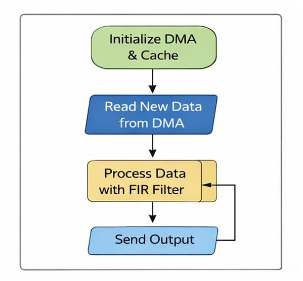
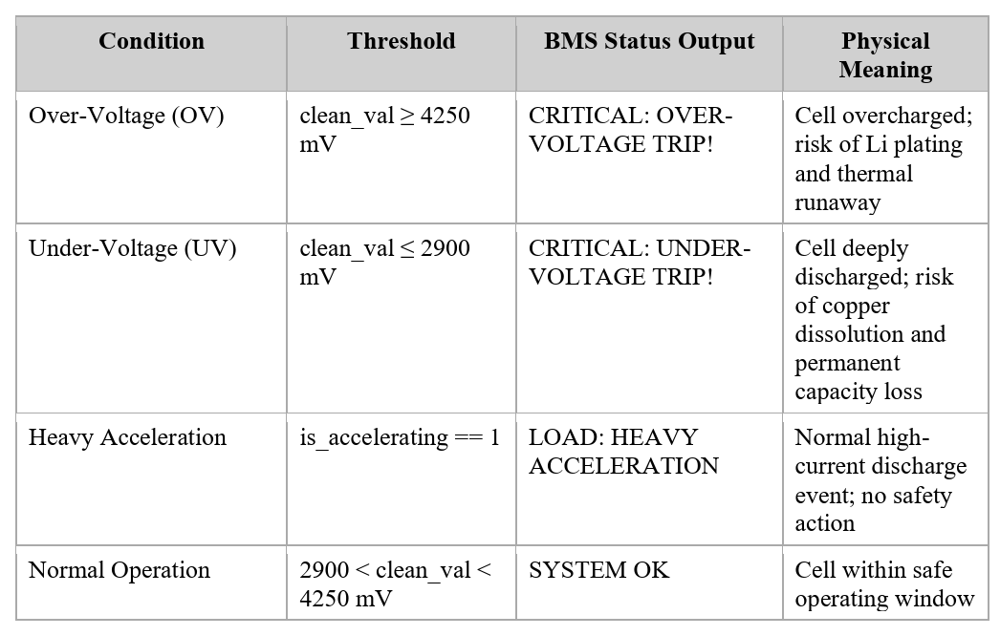

# ⚡ Real-Time Hardware-Accelerated EV BMS Telemetry

**Target Hardware:** Xilinx Zynq-7000 System-on-Chip (SoC)  
**Development Tools:** AMD Xilinx Vivado & Vitis Unified IDE  
**Team Members:** [YOGARATHINAM K], [PRADEEPKUMAR S], [HEMAVARSHINI M], [PRATHANYAA S]

## 🚗 Project Overview
In modern Electric Vehicles, traction inverters switch at incredibly high frequencies, creating massive Electromagnetic Interference (EMI). This noise corrupts the low-voltage analog sensors of the Battery Management System (BMS), potentially causing false safety shutdowns.

Traditional microcontrollers filter this noise using software (DSP), which consumes 100% of the CPU load and introduces latency. 

**Our Solution:** We built a Hardware-Software Co-Design architecture. We offloaded the computationally expensive DSP filtering to the FPGA fabric using an AXI DMA pipeline. This freed up the ARM Cortex-A9 processor to execute advanced EV physics simulations, State of Charge (SoC) estimation, and safety fault detection with zero latency.

 

## 🛠️ Hardware Architecture (Vivado)
To filter extreme inverter noise without taxing the CPU, we built a custom AXI data highway inside the Zynq-7000 SoC.
1. **Master Controller:** Zynq Processing System (PS) generating a 100MHz fabric clock. 
2. **AXI DMA Engine:** Configured in Simple Transfer mode to autonomously stream raw voltage data from memory (MM2S) to the hardware and capture the clean results (S2MM).
3. **FIR Filter Accelerator:** A 21-tap FIR Compiler IP maps the heavy convolution math directly onto the FPGA's DSP48E slices.

 
 

## 🧠 Bare-Metal Memory & Cache Coherency
In a Hardware-Software Co-Design system, the CPU and the DMA share the same physical DDR memory but have different views of it due to the CPU's L1/L2 cache layers. To prevent the data bus from fetching stale data, we enforce strict programmatic Cache Coherency.
👉 **[View Cache Coherency Implementation Source Code](./code/cache_management.c)**

## 🛡️ EV Physics & Safety State Machine
With a clean, latency-free telemetry stream secured by the FPGA, the ARM Cortex-A9 processor is dedicated entirely to application-layer safety logic.
👉 **[View BMS State Machine Source Code](./code/bms_state_machine.c)**

* **Dynamic Physics Simulation:** Our C-code models cell discharge rates, accelerator-induced voltage sags (250mV drops), and injects 300mV peak-to-peak inverter EMI.
* **Fault Detection Engine:** A state machine evaluates the hardware-cleaned data against strict Over-Voltage (4250mV) and Under-Voltage (2900mV) thresholds. 
* **The Result:** The system maintains **zero false-positive safety trips** despite aggressive simulated noise.

## 📅 The 6-Week Build Public Series
We are documenting the complete build process of this system on LinkedIn! 

* **Week 1:** The Architecture & The Bottleneck 
* **Week 2:** Hardware Architecture & The AXI DMA Pipeline 
* **Week 3:** DSP Math, Gain, & Software Pipelines 
* **Week 4:** Bare-Metal Memory Cache Management 
* **Week 5:** EV Physics & The Safety State Machine 
* **Week 6:** [Coming Soon]
